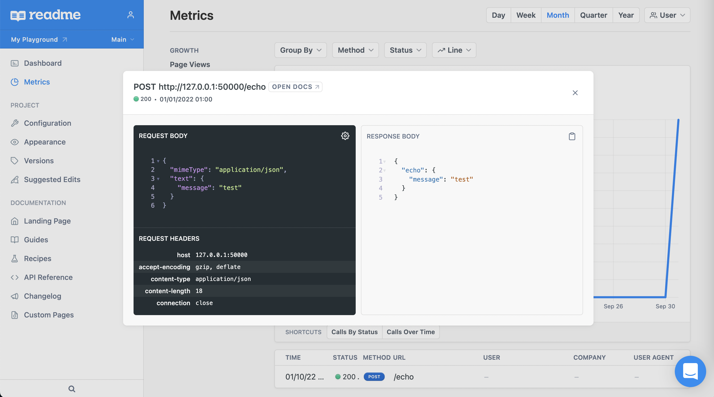

# Report API usage using [README.com](https://docs.readme.com/docs/api-metrics-in-readme)

Collect and publish API usage metrics to README.com

[](https://www.npmjs.com/readme-metric-reporter)
[](https://codecov.io/gh/igrek8/readme-metric-reporter)


[](https://npm.runkit.com/readme-metric-reporter)

## Installation

```bash
npm install --save readme-metric-reporter

yarn add readme-metric-reporter
```

## View in the dashboard



## [Integration](./runkit.js)

```ts
const { MetricReporter, MetricReporterMode, MetricReporterError } = require('readme-metrics-reporter');

/**
 * Get your API key here
 *
 * https://dash.readme.com/project/YOUR_PROJECT/v1/api-key
 */

const API_KEY = 'rdme_XXXXXXXXXXXXXXXXXXXXXXXXXXXXXXXXXXXXXXXXXXXXXXXXXXXXXXXXXXXXXXXXXXXXXX';

const reporter = new MetricReporter(API_KEY, {
  buffer: { size: 1, interval: 60000 },
  mode: MetricReporterMode.DEVELOPMENT,
});

reporter.on('error', (error, metrics) => {
  if (error instanceof MetricReporterError) {
    const message = error.response.body.toString();
    console.warn(message);
    // If a retry is needed (may cause infinite error reporting loop)
    // metrics.forEach((metric) => reporter.report(metric));
  }
});

reporter.report({
  _id: '1',
  group: {
    id: '::ffff:127.0.0.1',
  },
  clientIPAddress: '::ffff:127.0.0.1',
  request: {
    log: {
      creator: {
        name: 'readme-io-express',
        version: '1.0.0',
        comment: 'darwin/10.0.0',
      },
      entries: [
        {
          startedDateTime: '2022-01-01T00:00:00.000Z',
          time: 0,
          pageref: 'http://127.0.0.1/echo',
          request: {
            method: 'POST',
            url: 'http://127.0.0.1/echo',
            headers: [
              { name: 'host', value: '127.0.0.1:50000' },
              { name: 'accept-encoding', value: 'gzip, deflate' },
              { name: 'content-type', value: 'application/json' },
              { name: 'content-length', value: '18' },
              { name: 'connection', value: 'close' },
            ],
            httpVersion: 'HTTP/1.1',
            queryString: [{ name: 'search', value: 'criteria' }],
            postData: { mimeType: 'application/json', text: '{"message":"test"}' },
          },
          response: {
            headers: [
              { name: 'content-type', value: 'application/json; charset=utf-8' },
              { name: 'content-length', value: '27' },
            ],
            status: 200,
            statusText: 'OK',
            content: {
              mimeType: 'application/json; charset=utf-8',
              size: '27',
              text: '{"echo":{"message":"test"}}',
            },
          },
        },
      ],
    },
  },
});
```
